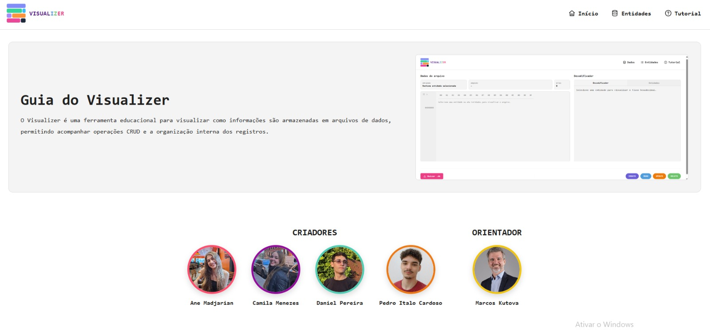
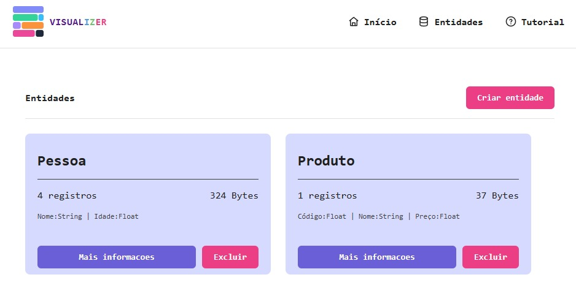
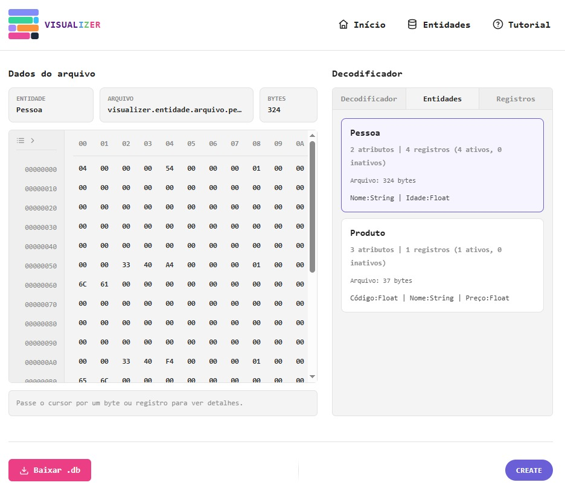
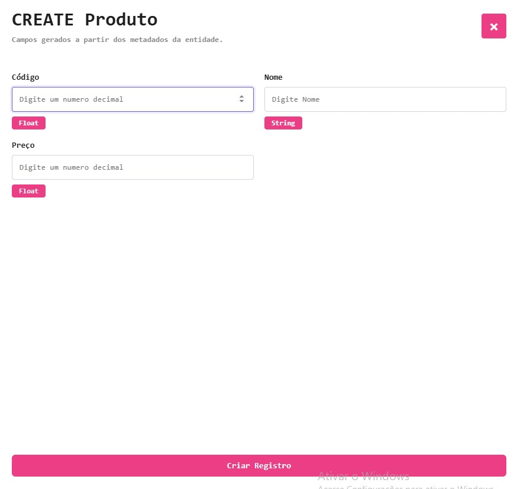
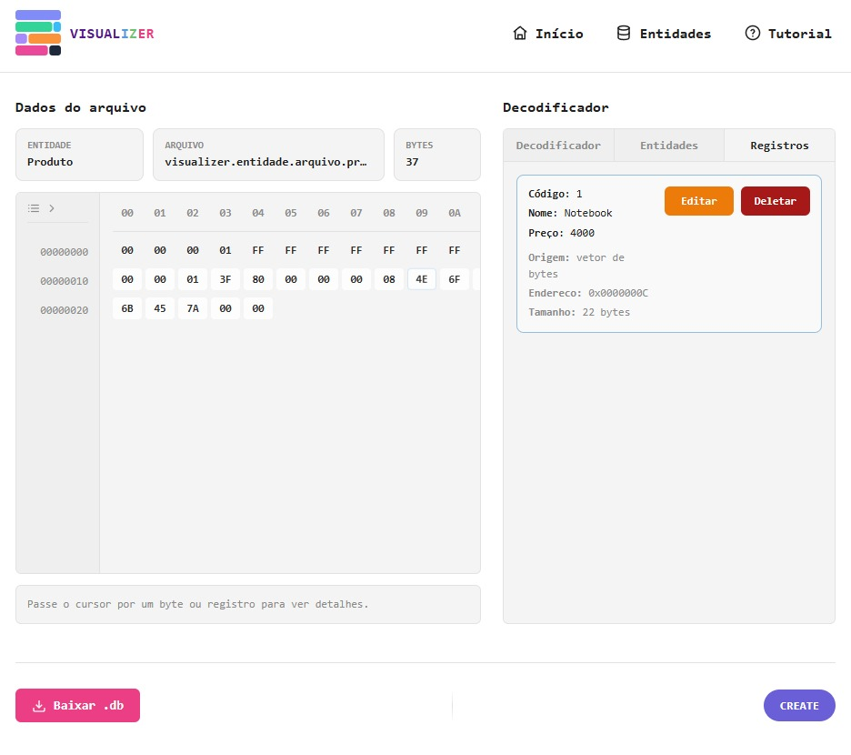

# TRABALHO PRÁTICO 04 - ALGORITMOS E ESTRUTURAS DE DADOS 3

**Pontifícia Universidade Católica de Minas Gerais**  
**Ciência da Computação**

Video de demonstração do projeto:     
Link para teste com os usuários e relatório: https://github.com/Pedro-Italo-BC/Visualizer---tp-04/blob/main/.docs/usuarios.md

**Autores:**  
Ane M. Viana  
Camila C. Menezes  
Daniel G. Pereira  
Pedro Ítalo B. Cardoso  

---

## Sumário

1. Descrição Completa
- Visão Geral
- Operações Implementadas
- Telas do Sistema (Prints)
2. Pergunta 01
3. Pergunta 02
4. Pergunta 03
5. Pergunta 04
6. Pergunta 05

---

## 1. Descrição Completa

### Visão Geral

Este trabalho teve como objetivo desenvolver uma aplicação web interativa para visualização das operações de CRUD (Create, Read, Update e Delete) e da organização dos dados em arquivos. O sistema foi construído utilizando HTML, CSS e JavaScript, permitindo que os usuários compreendam de forma prática como os registros são armazenados, recuperados, alterados e removidos.

A aplicação apresenta uma interface gráfica que representa visualmente as entidades, seus atributos e os registros armazenados, possibilitando acompanhar em tempo real os efeitos das operações realizadas. Dessa forma, conceitos normalmente abstratos relacionados a estruturas de dados e persistência em arquivos tornam-se mais acessíveis e intuitivos.

Além das funcionalidades de cadastro, consulta, alteração e exclusão de registros, o sistema oferece recursos de visualização que permitem observar a disposição dos dados nos arquivos, facilitando o entendimento dos mecanismos utilizados internamente pelo sistema.

Para validar a qualidade da solução desenvolvida, foi realizada uma avaliação com usuários, composta por um roteiro de testes e um questionário baseado na escala Likert. Os resultados obtidos indicaram elevado nível de satisfação, utilidade e usabilidade, com média geral de 4,86 em uma escala de 1 a 5. Toda a documentação encontra-se na pasta docs do projeto.

### Operações Especiais Implementadas

Além das operações tradicionais de CRUD, foram implementadas diversas funcionalidades com o objetivo de tornar o funcionamento interno da organização de arquivos mais visual e didático.

#### Gerenciamento de Entidades

O sistema permite criar entidades personalizadas, definindo dinamicamente seus atributos e respectivos tipos de dados (String, Integer, Float e Boolean). Cada entidade possui sua própria estrutura de registros e seu respectivo arquivo lógico.

#### Conversão entre Dados e Bytes

Os registros são automaticamente convertidos para sua representação em bytes antes de serem armazenados. Da mesma forma, os bytes podem ser interpretados novamente, reconstruindo os valores originais dos atributos. Essa funcionalidade demonstra o processo de serialização e desserialização utilizado em arquivos binários.

#### Geração Automática do Vetor de Bytes

Sempre que um registro é inserido, atualizado ou removido, o vetor de bytes da entidade é reconstruído automaticamente, refletindo o estado atual do arquivo. Dessa forma, a visualização permanece sincronizada com os dados armazenados.

#### Métricas de Armazenamento

São calculadas e exibidas informações sobre a estrutura armazenada, como quantidade de registros, registros ativos, tamanho de cada registro, tamanho total do vetor de bytes e estimativa do espaço ocupado pelos registros removidos.

#### Cálculo Automático do Tamanho dos Registros

O tamanho de cada registro é determinado automaticamente a partir dos atributos definidos para a entidade, considerando o espaço necessário para armazenar cada tipo de dado.

#### Exportação do Arquivo

A aplicação permite exportar o conteúdo gerado para um arquivo binário (.db), possibilitando que a estrutura construída seja salva para utilização posterior.

#### Persistência Local

As entidades e seus registros permanecem armazenados utilizando o Local Storage do navegador, permitindo que os dados continuem disponíveis mesmo após o fechamento da aplicação.

### Telas do Sistema (Prints)

### Página de Tutorial

### Criar Entidade

### Dados do Arquivo

### Criar Registros

### Registros

---

## 2. Pergunta 01

**A página web com a visualização interativa do CRUD de produtos foi criada?**

Sim. Foi desenvolvida uma página web que permite a visualização interativa dos dados, incluindo operações de CRUD (Create, Read, Update e Delete) aplicadas às entidades e registros.

---

## 3. Pergunta 02

**Há um vídeo de até 3 minutos demonstrando o uso da visualização?**

Sim. Foi produzido um vídeo curto demonstrando o funcionamento da aplicação e suas principais funcionalidades.

---

## 4. Pergunta 03

**O trabalho foi criado apenas com HTML, CSS e JS?**

Sim. O projeto foi desenvolvido utilizando apenas HTML, CSS e JavaScript puro, sem o uso de frameworks ou bibliotecas externas.

---

## 5. Pergunta 04

**O relatório do trabalho foi entregue no APC?**

Sim. O relatório foi devidamente entregue na plataforma APC conforme solicitado.

---

## 6. Pergunta 05

**O trabalho está completo e funcionando sem erros de execução?**

Sim. O sistema está funcional e executa corretamente todas as operações propostas, sem erros que impeçam o uso.

---

## 7. Pergunta 06

**O trabalho é original e não a cópia de um trabalho de outro grupo?**

Sim. O projeto é original e foi desenvolvido pelo grupo, sem cópia de trabalhos de outras equipes.
